# QuietRelay

QuietRelay prepares a daily allocation plan for a small community organization.
It matches anonymous requests with stock and volunteer capacity, using items with
the earliest expiry first. When stock is short or no volunteer is available, it
stops and gives a coordinator the evidence needed to decide what happens next.

The repository has two working parts:

- A Strands agent that runs three policy-constrained tools against a local
  Ollama model and a deterministic stock-aware recovery planner.
- A console for up to 100 requests, 100 stock lots and 30 volunteers. Import
  CSV or pasted spreadsheet tables, or add records in the editor. Review a
  plan, save its inputs and decisions, and restore them on another visit.
  The public page runs the deterministic tools in the browser; the local
  console runs the Strands agent. Each mode is labeled on screen.

Neither part sends messages, spends money, or dispatches a volunteer.

## How the agent boundary works

1. The application accepts only the four expected top-level fields and rejects
   unknown fields inside every record. Source IDs are replaced with short
   per-run handles, while items and zones come from small local catalogs.
2. The deterministic planner validates record counts, units, dates, duplicate
   identifiers, and volunteer capacity. It stages first-expire, first-out stock,
   then commits it only after an augmenting path safely assigns volunteer
   capacity.
3. `inspect_conflicts` exposes only two allowlisted option IDs and aggregate
   counts. `select_recovery` accepts only the policy-best option, and
   `validate_recovery` independently checks stock, expiry, zone, capacity, and
   provenance.
4. The local model must complete those three tools in order, but its prose is
   ignored. The CLI prints the validated plan with an empty `external_actions`
   list.

```mermaid
flowchart LR
    A[Anonymous request, stock, and volunteer data] --> B[Strict field and size validation]
    B --> C[Stock-aware FEFO and augmenting-path options]
    C --> D[Inspect fixed aggregate conflicts]
    D --> E[Select one allowlisted recovery]
    E --> F[Independently validate typed constraints]
    F --> G[Authoritative allocation and review JSON]

    H[CSV intake and editable console] --> A
    H --> M[Browser-only tool preview: no model]
    M --> I
    G --> I[Coordinator review]
    I --> J[Local approval or undo]
    J --> K[Validated workspace and handover export]

    K --> L[No message, payment, or real-world dispatch]
```



## Privacy and safety

The demo data contains request, lot, and volunteer IDs only. It has no names,
addresses, phone numbers, health records, financial data, or live organization
records. The parser replaces source IDs with per-run handles before planning.
Ollama is fixed to `127.0.0.1`, and the model receives the output of the
validated planner rather than the source payload.

Work stays in browser memory until you choose **Save workspace**, which writes
the anonymous inputs, verified plan and review decisions to local browser
storage. **Restore saved work** checks that plan against its saved inputs before
reopening it. The file contains no proof of a new model run. **Download
workspace** and **Open workspace** provide the same workflow across devices.
An inconsistent plan, unknown field or invalid decision is rejected before replacing
current work. A failed browser save leaves work open and offers file download.
The public preview makes no planning API request. In local agent mode, its only
application data request is a same-origin POST to the Python server on
numeric loopback. The server rejects non-local Host and Origin values, does not
enable CORS, caps request, response, and static-asset sizes, uses a fixed input
deadline and bounded request workers, and does not log request data.

## Run the local agent

Tested toolchain: Python 3.12.13, uv 0.11.28, and Ollama 0.32.14.

```bash
ollama pull qwen3:4b-instruct-2507-q4_K_M
OLLAMA_NO_CLOUD=1 OLLAMA_HOST=127.0.0.1:11434 ollama serve
uv sync --dev
uv run python scripts/demo_local.py
```

Run `ollama serve` in a separate terminal after the model is present. Before
inference, the script verifies the exact local model digest. It exercises the
three policy-constrained Strands tools in a killable child process with fixed
wall-clock, turn, and token limits, then prints the typed plan rather than the
model's free-form prose. The fixture demonstrates safe volunteer reassignment:
the submitted greedy control resolves one request, while the recovery plan
resolves both without changing stock policy.

## Run the integrated console

Tested toolchain: Node.js 22.23.1 and npm 10.9.8.

```bash
cd frontend
npm ci
npm run build
cd ..
uv run python scripts/serve_local.py
```

Open `http://127.0.0.1:4173` with Ollama running. Import tables or edit the sample and select
**Run local agent**. The server verifies the pinned model, runs the three Strands
tools, and returns a typed plan. The console checks the result against the exact
submitted input before showing it.

The original sample has three ready requests in the first-fit control and four
in the recovery plan. Set rice stock to **6** and volunteer 1 capacity to **3**
to make all five requests ready. Expired stock is excluded. These are synthetic
examples, not measured outcomes from a community organization.

Select a request to inspect its allocation or shortage evidence. Ready requests
can be approved locally; unresolved requests can be marked for follow-up.
Follow-up does not reserve stock. Undo reverses a local decision. Editing any
input or running a new plan clears earlier approvals. Activity is kept in the
current tab only, with the latest 30 events visible.

After replanning, **Prepare handover** opens a readable text snapshot of all
requests, their current decisions, allocation or shortage evidence, and the
input resources. Unreviewed requests stay explicitly pending. The file labels
browser preview versus local agent results and records no dispatch. It remains
available after the tab closes; subsequent edits do not update the saved file.
Use **Copy review** or **Download text** to keep it. If the browser prevents
either action, the full text remains selectable on screen. Changes to inputs,
approvals, or follow-up decisions close the snapshot so it can be prepared again.

The [local-agent walkthrough](https://hyunsikparker.github.io/quietrelay/walkthrough/)
starts with a 1:23 continuous recording from September 10. It shows two real
Strands runs, a seven-request CSV import, expiry exclusion, approval, follow-up,
save/reload/restore, handover download, and rejection of an inconsistent saved
file. English captions and synthetic narration are included. The earlier
September 6 recording remains below it for comparison. Both use synthetic data.

The [public preview](https://hyunsikparker.github.io/quietrelay/) calculates new
inputs using a browser implementation of the deterministic planning tools. It
does not run Strands or an LLM. Use `?mode=replay` on the local console to test
that same browser mode. The initial five-request sample is synthetic. Imports accept anonymous IDs
(`req-number`, `lot-number`, `vol-number`) and the supported item and zone
catalogs; names, contact columns and free-form text are rejected. This remains
a prototype: it has not been tested by a community organization.

## Bring another day’s data

Choose **Import tables**. Each tab begins with the current table and its exact
column headings. Paste CSV or tab-separated spreadsheet cells, or open a CSV
file. A request needing several items uses one row per item with the same
request ID, zone and priority. Volunteer zones use `|`, such as `north|south`.
A stock or volunteer table can contain just its header when none are available.

**Check all tables** validates the three tables together and reports their
record counts. **Use checked data** loads them and clears the old plan and
approvals. Invalid tables leave current work intact. The editor also supports
adding and removing requests, needed items, lots and volunteers.

For a second synthetic example, import the [requests](frontend/public/examples/seven-requests/requests.csv),
[stock](frontend/public/examples/seven-requests/stock.csv) and
[volunteers](frontend/public/examples/seven-requests/volunteers.csv) tables with
planning date **2026-08-22**. Six requests can be allocated; `req-706` needs
three rice units after usable stock is exhausted. The expired 100-unit lot is
excluded. `req-701` needs both rice and milk.

Source IDs stay visible in the console and are mapped to per-run handles in
the handover. Units are limited to 1–100, priority to 1–5 and volunteer capacity
to 1–10 requests. The four items are rice, milk, blankets and oats; the three
zones are north, east and south. CSV files stay on the device. In local agent
mode, imported inputs go only to the same-origin loopback planner endpoint.

## Verify the repository

After `uv sync --dev` and `npm ci` in `frontend`, run `npm --prefix frontend run
test:planner` to compare 24 frozen scenarios and 62 additional intake cases
against the Python planner. The added cases cover 100 split lots for one
request, larger record counts, multi-item requests, empty resources and
expiry boundaries. `npm --prefix frontend run test:workspace` checks CSV/TSV
parsing, source IDs, file tampering, stale decisions and failed storage
readback. `npm --prefix frontend run test:review` checks the complete handover.

```bash
uv run pytest
uv run ruff check src tests scripts
cd frontend
npm run build
npm run lint
```

The Python suite covers schema rejection, privacy limits, FEFO allocation,
stock-scarcity regressions, augmenting paths, multi-need and capacity stress,
the three Strands tools, loopback origin checks, static path safety, and the
integrated plan endpoint.
